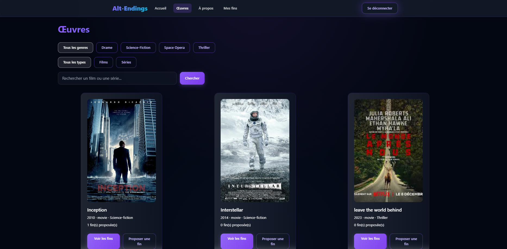
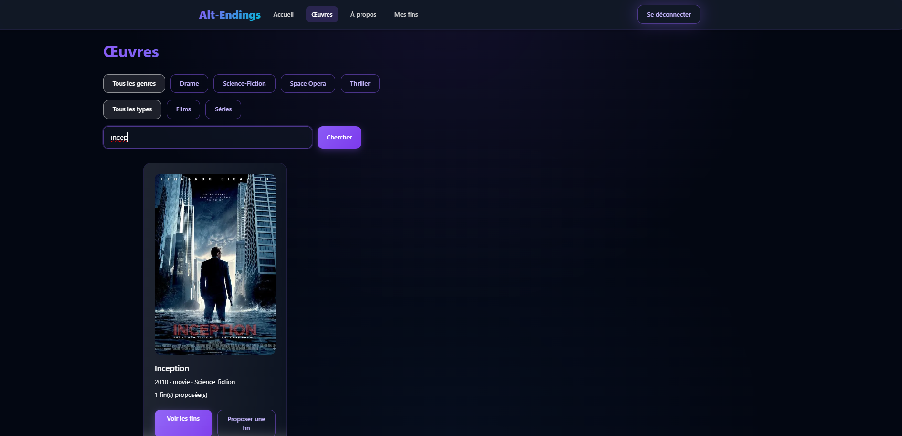
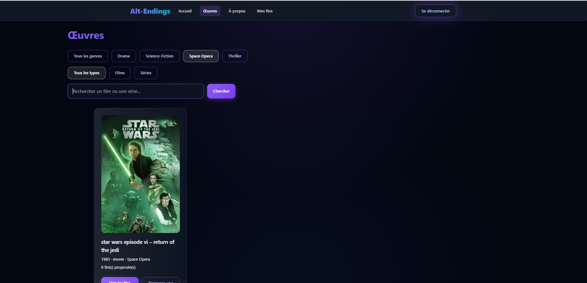
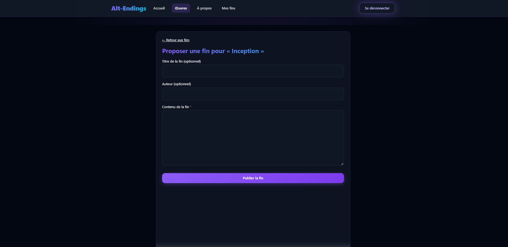
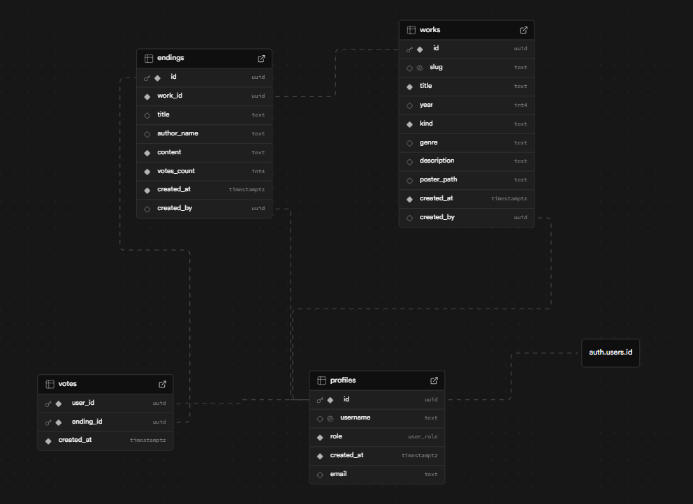
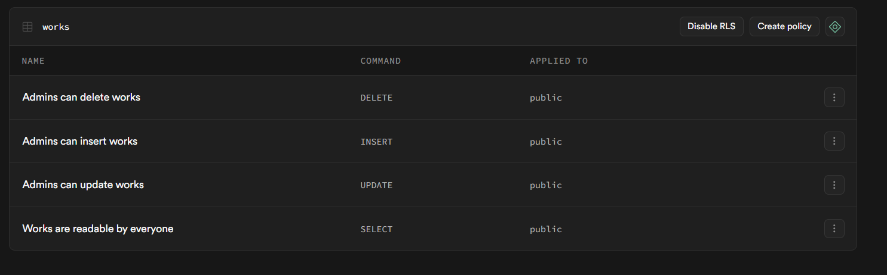

# PROJECT.md — Alt-Endings

## Nom du projet : Alt-Endings

## Membres de l’équipe :
- Omar El Alami El Fellousse
- Clément D'Alberto
- Luc Bernard Fernand BANAG LIBITE

##  URL de déploiement :
https://webtech-208.vercel.app/

---

# 1. Concept et expérience utilisateur

Alt-Endings est une plateforme permettant aux utilisateurs de proposer des fins alternatives pour des œuvres (films et séries), de voter pour celles des autres, et de gérer leurs propres créations via un espace dédié.

##  Captures d'écran (UI/UX)  
  Page d’accueil:
- 
  Page de recherche d'œuvres:
- 
  Page de filtres de genre:
-  
  Formulaire de proposition d'une fin
- 

---

# 2.  Fonctionnalités complètes (Full-Stack)

##  Authentification
- Inscription via email/mot de passe  
- Connexion fonctionnelle  
- Déconnexion implémentée  
- Interface mise à jour selon l’état utilisateur  
  - Boutons grisés si non connecté  
  - Pages protégées  

Notes : Auth gérée via Supabase.  
Auto-évaluation : Validé

---

##  Opérations CRUD

### Ressource principale : Endings (Fins alternatives)

- Créer : Formulaire de création d’une fin  
- Lire : Liste des fins sur la page de l’œuvre  
- Mettre à jour : Modification via “Mes fins”  
- Supprimer : Suppression avec confirmation  

Notes : CRUD complet et sécurisé par RLS.  
Auto-évaluation :  Validé

---

##  Relations entre les données

### Relations principales :
- `profiles` ↔ `works`  
- `works` ↔ `endings`  
- `profiles` ↔ `endings`  
- `profiles` ↔ `votes`  
- `endings` ↔ `votes`

Notes : Relations stables et fonctionnelles.  
Auto-évaluation : Validé

---

##  Recherche & filtrage
- Recherche par titre  
- Filtre par genre(thriller, science-fiction etc.) 
- Filtre film/série  

Auto-évaluation :  Validé

---

##  Intégration API externe

- API utilisée : OMDb — https://www.omdbapi.com  
- Données récupérées :  
  - Durée (runtime)  
  - Note IMDb  
- **Affichage :** Section "Infos officielles (OMDb)" sur la page œuvre  

**Auto-évaluation : Validé

---

# 3.  Ingénierie & Architecture

##  

**Auto-évaluation : Validé

---

##  Row Level Security (RLS)

**Auto-évaluation : Validé

---

##  Composants serveur & client

###  Composant serveur
`client/app/layout.js`  
→ Gère le layout global, sans logique interactive.

###  Composant client
`client/app/works/[workId]/page.js`  
→ Contient logique vote, OMDb, et interactivité (React hooks).

---

# 4.  Auto-réflexion & Feedback

## Réalisation dont je suis le plus fier

Omar El Alami El Fellousse :  
Je suis le plus fier d’avoir mis en place le CRUD complet et sécurisé avec les politiques RLS, d’avoir créé la page Mes fins qui permet aux utilisateurs de gérer leurs contenus, ainsi que d’avoir intégré l’API OMDb pour enrichir les fiches œuvres avec des données externes.

Clément D'Alberto:  
Je suis particulièrement fier d’avoir travaillé sur toute la partie front-end, notamment l'amélioration de l’UI/UX générale du site.  
Et j'ai également travaillé sur plusieurs composants réutilisables pour rendre l'inteface puis fluide et ergonomique

Luc Bernard Fernand BANAG LIBITE:
La réalisation dont je suis le plus fier est d’avoir mis en place une base de données structurée et cohérente avec Supabase. J’ai réussi à gérer les relations entre utilisateurs, œuvres et fins alternatives, ce qui a vraiment solidifié le fonctionnement de tout le projet. Voir la partie base de données fonctionner parfaitement avec le front a été très satisfaisant.

##  Ce que j’aimerais améliorer

Omar El Alami El Fellousse :  
J’ajouterais une pagination, des commentaires, et une amélioration de l’UX mobile.

Clément D'Alberto:
Avec plus de temps, j’aurais aimé améliorer encore l’expérience utilisateur par exemple pousser plus loin les animations et ajouter un système de recommandations,

Luc Bernard Fernand BANAG LIBITE:
Avec plus de temps, j’aurais aimé aller plus loin dans l’optimisation de la base de données, notamment en ajoutant plus de policies RLS et en améliorant la sécurité au niveau des accès. J’aurais aussi aimé mieux automatiser certaines relations et valider davantage les données côté serveur.

##  Feedback sur le cours (bonus)

Omar El Alami El Fellousse :  
Cours très intéressant, j’ai vraiment aimé travailler avec Supabase et Next.js. Le projet final m’a beaucoup appris et m’a permis de comprendre concrètement comment construire une vraie application moderne de A à Z.

Clément d'Alberto :
J’ai trouvé le cours très intéressant, surtout le fait de travailler sur un projet complet. Apprendre à utiliser Next.js, Supabase et les bonnes pratiques front/back, je trouve aussi que les cours et le projet sont également réutilisables pour d'autres projets dans le futur.

Luc Bernard Fernand BANAG LIBITE :
J’ai apprécié le fait de travailler sur un vrai projet complet, ce qui m’a permis de comprendre la logique entre front-end, back-end et base de données. Le cours est motivant et concret. Pour l'améliorer, quelques exemples guidés sur Supabase et les bonnes pratiques de structure de données seraient vraiment utiles.

#  Fin du document
