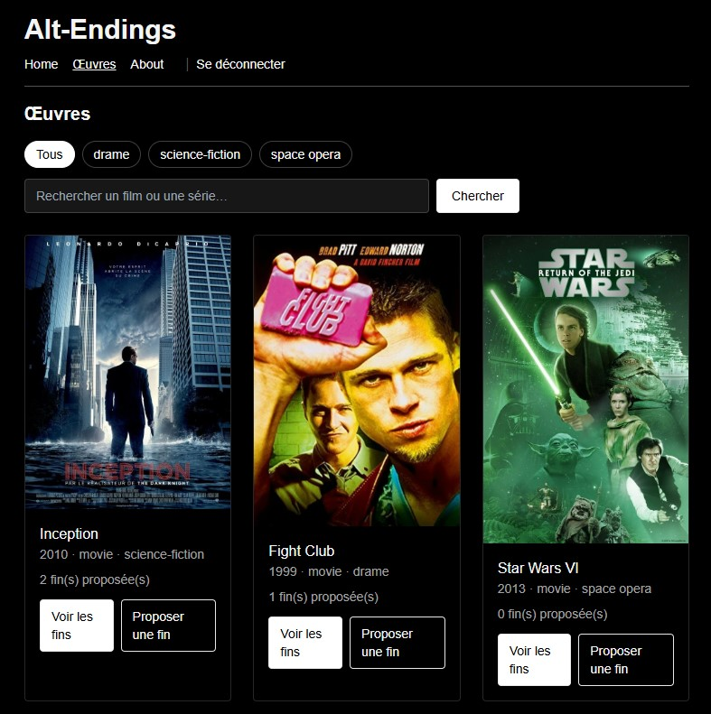
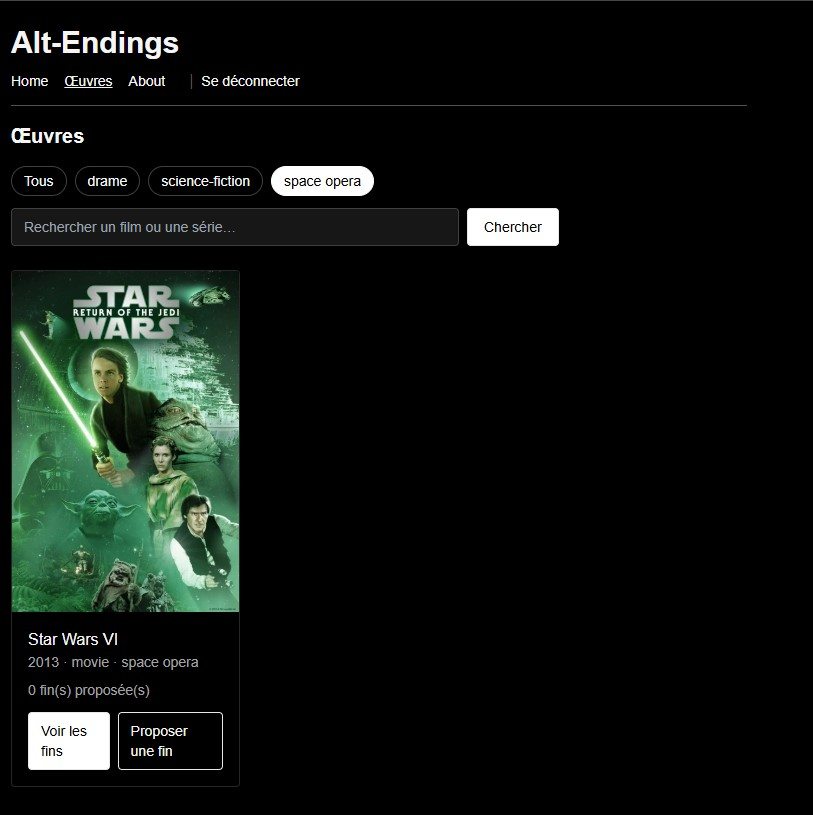
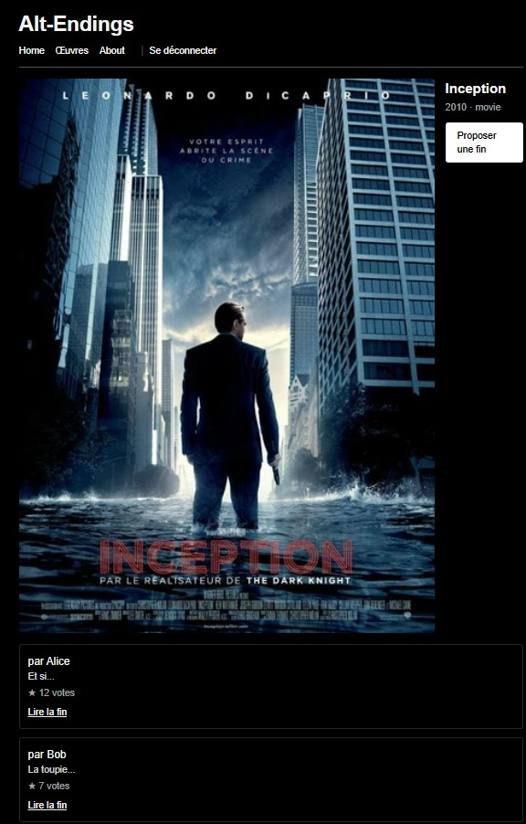
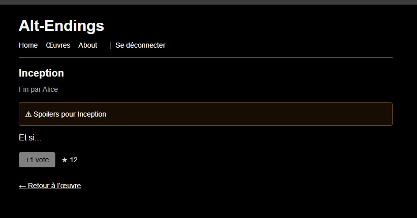
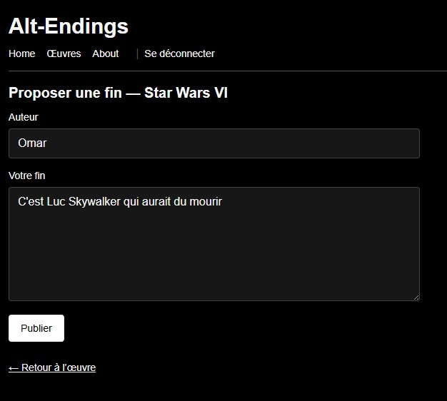

# webtech-208 — Alt-Endings

Projet Next.js (App Router) : proposer et voter des fins alternatives pour des œuvres.

## Sommaire
- [Prérequis](#prérequis)
- [Installation & Lancement](#installation--lancement)
- [Instructions d’utilisation](#instructions-dutilisation)
- [Fonctionnalités](#fonctionnalités)
- [Tech & Structure](#tech--structure)
- [Contributeurs](#contributeurs)

## Prérequis
- Node.js v22+
- npm
- Chrome/Firefox

## Installation & Lancement

1. Cloner ce dépôt :

   ```bash
   git clone https://github.com/Clement-dl/webtech-208.git
   cd webtech-208

2. Installer les dépendances :
    ```bash
    npm install

## Instructions d’utilisation

1. Lancer l’application en mode normal :
   ```bash
   npm start

2. Lancer l’application en mode développement :
    ```bash
    npm run dev

3. Ouvrir un navigateur et accéder à :

- Page d’accueil : http://localhost:3000/
- Œuvres (grille + filtres) : http://localhost:3000/works
- À propos : http://localhost:3000/about
- Connexion / Inscription (mock) : http://localhost:3000/login · http://localhost:3000/signup

## Fonctionnalités

### 1) Connexion / Inscription *(pas encore Supabase)*
- **Chemins** : `/login`, `/signup`
- **Description** : formulaires d’auth simulée (pas de supabase pour l'instant).
- **Capture** : 

### 2) Page “Œuvres” — Grille + posters
- **Chemin** : `/works`
- **Description** : affichage en **3 colonnes** avec posters **locaux** et compteur de fins.
- **Capture** : 

### 3) Filtre par **genre**
- **Chemin** : `/works?genre=<genre>`
- **Description** : pills sous le titre “Œuvres” pour filtrer par genre.
- **Capture** : 

### 4) Barre de **recherche**
- **Chemin** : `/works?q=<terme>` (cumulable avec `genre`)
- **Description** : recherche par titre, combinable avec le filtre de genre.
- **Capture** : 

### 5) Détail d’une œuvre & liste des fins
- **Chemin** : `/works/[workId]`
- **Description** : affiche les infos de l’œuvre et les fins proposées (triées par votes).
- **Capture** : 

### 6) Lecture d’une fin + **vote** (anti multi-vote local)
- **Chemin** : `/works/[workId]/endings/[endingId]`
- **Description** : lecture complète d’une fin et bouton **+1 vote** (verrou via `localStorage`).
- **Capture** : 

### 7) Proposer une fin
- **Chemin** : `/works/[workId]/submit`
- **Description** : formulaire pour soumettre une nouvelle fin (mock).
- **Capture** : 


## Tech & Structure

### Stack
- **Framework** : Next.js 15 (App Router)
- **Langage** : JavaScript (ES202x)
- **UI** : Tailwind CSS v3 + PostCSS + Autoprefixer
- **Auth (mock)** : logique locale (`lib/auth.js`) — *pas encore Supabase*
- **Données mock** : `lib/fakeDb.js` (WORKS, ENDINGS)
- **Images** : `next/image` + posters locaux dans `public/posters/`


## Contributeurs

- Omar El Alami El Fellousse 
- Clément  D'Alberto
- Luc Bernard
